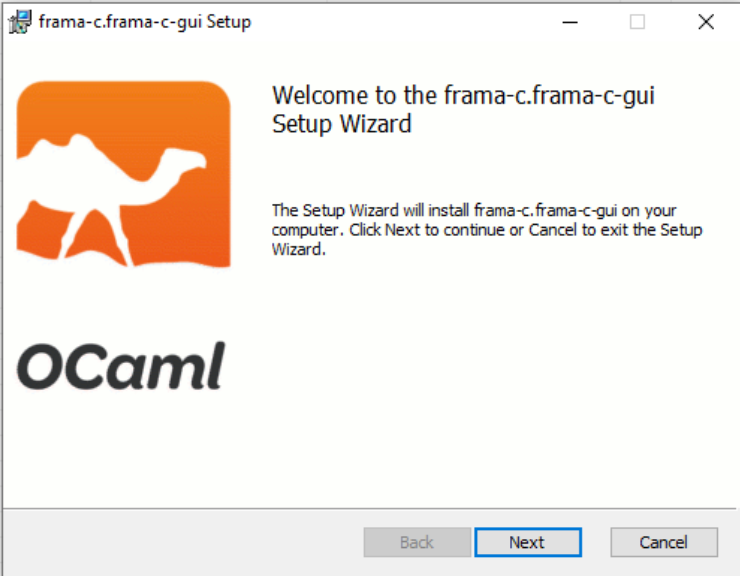
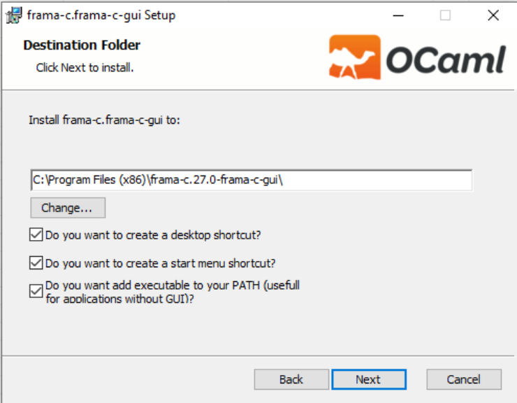
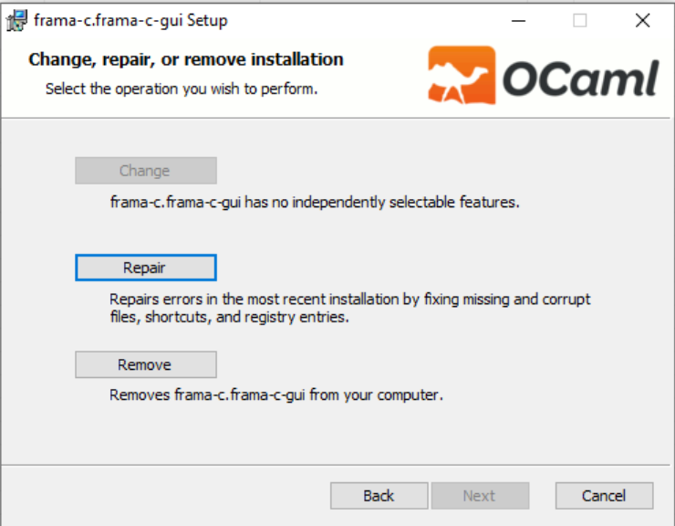

# opam-wix

[opam-wix](https://github.com/OCamlPro/opam-wix) is a Cygwin plugin for [opam](https://opam.ocaml.org/), the OCaml package manager. This plugin provides integration with the [WiX Toolset](https://wixtoolset.org/), allowing you to create Windows Installer packages (MSI) for your OCaml applications and packages.

The resulting MSI package generated by opam-wix is a portable installer that can be used on any Windows machine. This means you can distribute the generated MSI package to users or deploy it on different machines without restrictions.

## Features

- Generate Windows Installer packages (MSI) for OCaml applications from your environement.
- Define installation directories, shortcuts, and registry keys.
- Integration with opam, leveraging its package metadata and dependency resolution.

## Installation

To install the opam-wix plugin, follow these steps:

#### 1. Install opam
First, check if you have opam installed. If not, the easiest way is to install it via Cygwin: package `ocaml`, `opam` and `gcc-g++`
for mccs. In the next version of opam, there will be cygwin depexts handling, you will no
more need to install it manually.
You can install `ocaml`, `opam`, and `gcc-g++` Cygwin packages, or run this command,
don't forget to replace `C:\\cygwin64` by your Cygwin root:
```bash
path/to/setupx86-64 --root C:\\cygwin64 --quite-mode --no-desktop --no-adminmenu --no-startmenu --packages=ocaml,opam,gcc-g++
```
Then you can initialise your opam with the default repository.
```bash
opam init
```

#### 2. Install Wix toolset
* Install [Wix toolset](https://wixtoolset.org) (stable version =< 3.11) and set installation path (often in Program Files) in variable:
```bash
export WIXPATH='/cygdrive/c/Program Files (x86)/<your installation directory>'
```
* Check that you have the tool `uuidgen`, otherwise install `util-linux` Cygwin package.

#### 3. Install the plugin
```bash
opam pin https://github.com/OCamlPro/opam-wix.git
```

## Usage

To generate MSI file for the executable installed by `pkg` run:

```bash
opam wix pkg
```

To generate MSI file for an executable `bin` within package `pkg` run:

```bash
opam wix pkg --binary bin --wix-path $WIXPATH
```

To generate MSI file for an executable from the file system `bin-path` boxed in `pkg`, run:

```bash
opam wix pkg --binary-path bin-path --wix-path $WIXPATH
```

For customize interface purpose you can override some default graphic components like main icon :
```bash
opam wix pkg --binary bin --wix-path $WIXPATH --ico new/path/to/icon
```

**Note**:
- Chosen executable shouldn't be a script!
- Since `WIXPATH` often contains spaces, it is fine if program prints the warning about it.

For more information :

```
SYNOPSIS
       opam-wix PACKAGE [-b NAME|--bp PATH] [OTHER OPTION]…

DESCRIPTION
       This utility is an opam plugin that generates a standalone MSI file.
       This file is used by Windows Installer to make available a chosen
       executable from an opam package throughout the entire system.

       Generated MSI indicates to system to create an installation directory
       named 'Package Version.Executable' under "Program Files" folder and to
       store there the following items:

       executable.exe
           The selected executable file from package 'PACK'. There are two
           options how to indicate where to find this binary. First, is to let
           opam find binary with the same name for you with -b option. Second,
           is to use the path to binary with --bp option. In this case binary
           will be considered as a part of package and its metadata.

       *.dll
           All executable's dependencies libriries found with cygcheck.

       icon and *.bmp
           Additional files used by installer to customise GUI. Options --ico,
           --dlg-bmp and --ban-bmp could be used to bundle custom files.

       Additionnaly, installer gives to user a possibility to create a
       shortcut on Desktop and Start menu as well as adding installation
       folder to the PATH.

PACKAGE ARGUMENT
       PACKAGE (required)
           The package to create an installer

BINARY ARGUMENT
       -b NAME, --binary=NAME
           The binary name to handle. Specified package should contain the
           binary with the same name.

       --bp=PATH, --binary-path=PATH
           The path to the binary file to handle

OTHER OPTIONS
       --ban-bmp=FILE
           BMP file that is used as background for banner for installer.

       --dlg-bmp=FILE
           BMP file that is used as background for dialog window for
           installer.

       --ico=FILE
           Logo icon that will be used for application.

       -o DIR, --output=DIR (absent=~/OPAM/opam-wix)
           The output directory where bundle will be stored

       --pkg-guid=UID
           The package GUID that will be used to update the same package with
           different version without processing throught Windows Apps &
           features panel

       --conf=PATH
           Configuration file for the binary to install.
```
### Config file

```
Configuration
       Despite arguments allowing partial configuration of the utility, for
       complete support of installing complex programs and non self-contained
       binaries, it is necessary to provide a config file with opam-format
       syntax (See https://opam.ocaml.org/doc/Manual.html). Such a file allows
       opam-wix to determine which additional files and directories should be
       installed along with the program, as well as which environment
       variables need to be set in the Windows Terminal.

       To specify paths to specific files, you can use variables defined by
       opam, for example, %{share}%/path, which adds the necessary prefix. For
       more information about variables, refer to
       https://opam.ocaml.org/doc/Manual.html#Variables. The config file can
       contain the following fields:

       opamwix-version
           The version of the config file. The current version is 0.1.

       ico, bng, ban
           These are the same as their respective arguments.

       binary-path, binary
           These are the same as their respective arguments.

       embbed
           A list of files paths to include in the installation directory.
           Each element in this list should be a list of two elements: the
           first being the destination basename (the name of the file in
           the installation directory), and the second being the path to the
           directory itself. For example: ["file.txt" "path/to/file"].

       envvar
           A list of environment variables to set/unset in the Windows
           Terminal during install/uninstall. Each element in this list should
           be a list of two elements: the name and the value of the variable.
           Basenames defined with embbed field could be used as variables, to
           reference absolute installed path. For example:
           embbed: [ "mydoc" "%{package:doc}%"]
           envvar: [ "DOC" "%{mydoc}%"]
           will install directory referenced by package:doc opam variable in
           <install-dir>/mydoc and set DOC environment variable to the
           <install-dir>/mydoc absolute path
```

### Config file example

```
opamwix-version : "0.1"
embbed-file : [
    "%{bin}%/dune"
    "%{lib}%/opam-core/opamACL.ml"
    "dune-project"
]
embbed-dir: [
    ["share" "%{share}%/dune"]
    ["data" "./data"]
]
envvar: [
    ["VAR1" "toto"]
    ["VAR2" "titi"]
    ["VAR2" "tata"]
]
```


## Installer

Final installer GUI consists of three component :

**The Welcome page** serves as the initial step when running the installer. It provides essential information about the package-executable pair that you are about to install.



**Installation Options.** During the installation process, you will be presented with various options to customize the installation according to your preferences. The Installation Options section allows you to make the following choices:

1. **Path Selection:** You have the flexibility to choose the desired path on your Windows system where you want to install the executable.

2. **Shortcut Creation:** You can decide whether you want shortcuts to be created for the installed software. You have two choices:

   - **Desktop:** Selecting this option will create a shortcut icon on your desktop.

   - **Start Menu:** By choosing this option, a shortcut to the software will be added to the Start Menu.

3. **`PATH` Environment Variable:** You can choose whether or not to add the path to the installed binary in the `PATH` environment variable. On uninstall, the installer will remove the path to the installed binary from the `PATH` variable.



After installation is done, you would like to remove it one day. For this purpose you should relaunch msi package and to click on **Remove**.



## Licence

Copyright 2023 OCamlPro

All rights reserved. This file is distributed under the terms of the
GNU Lesser General Public License version 2.1, with the special
exception on linking described in the file LICENSE.
