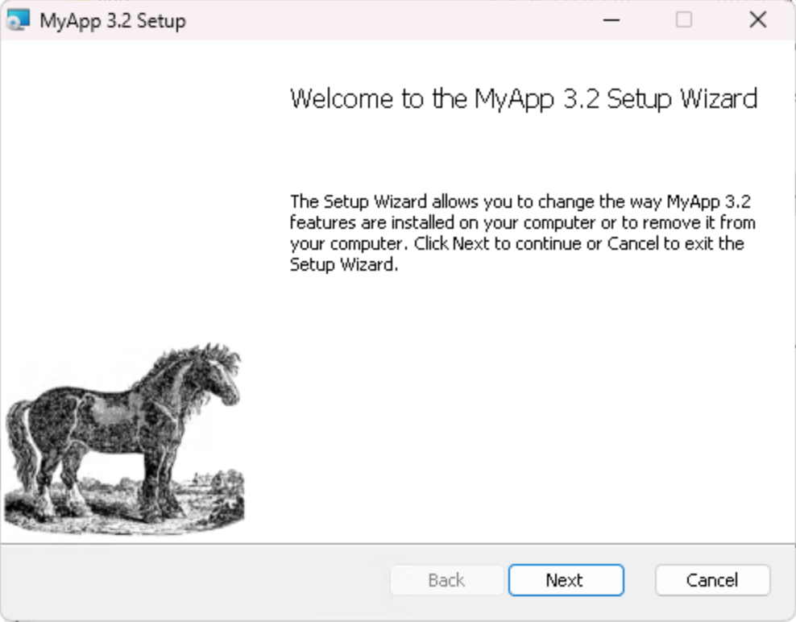
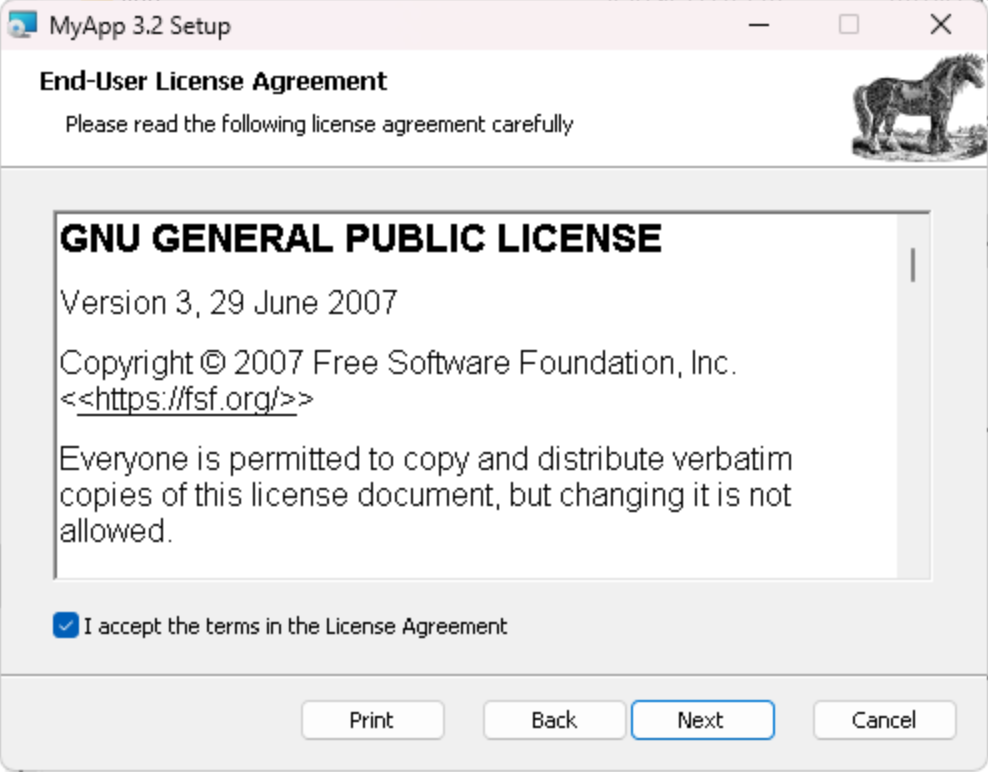
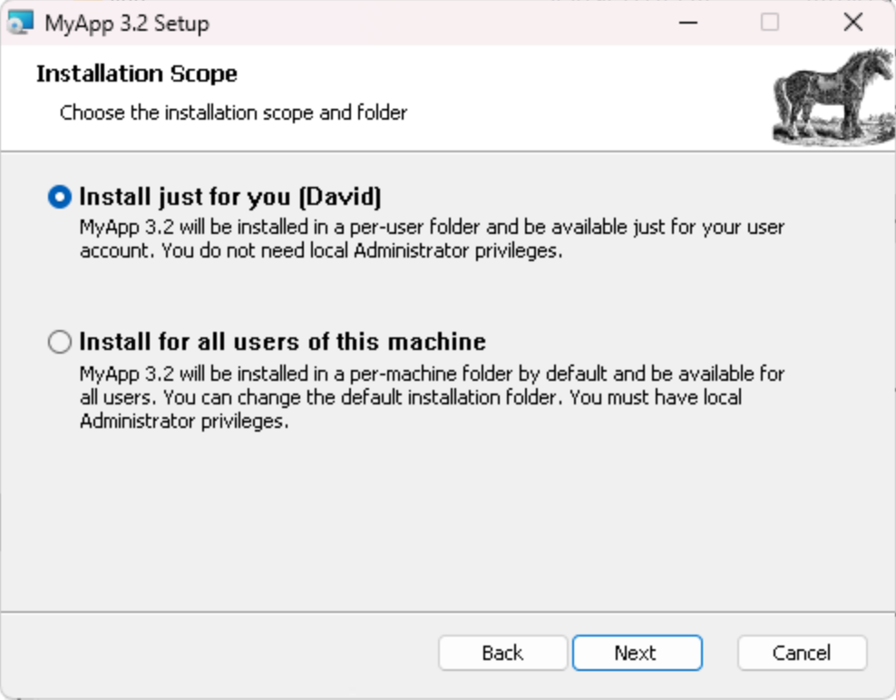
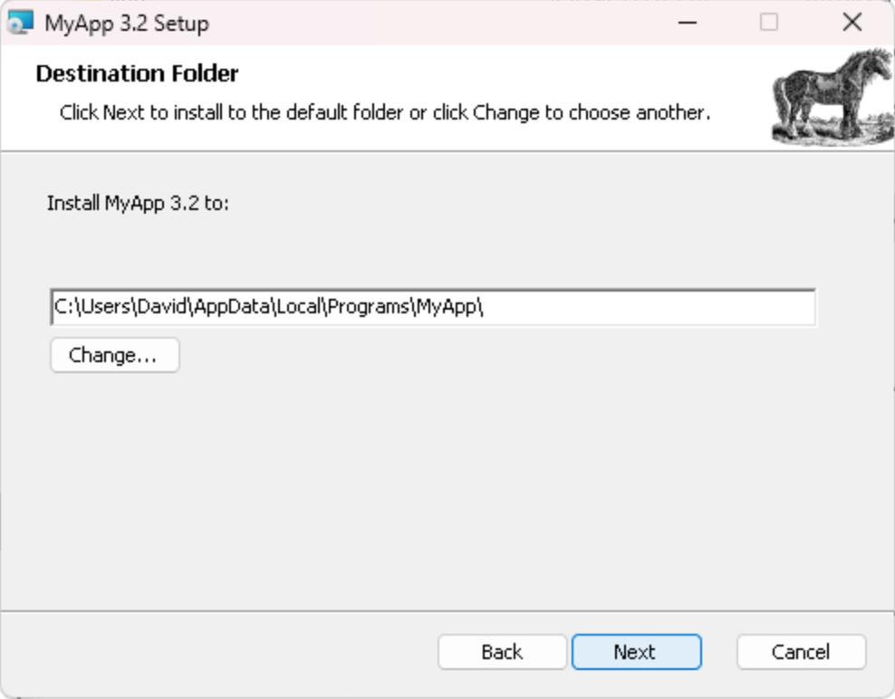
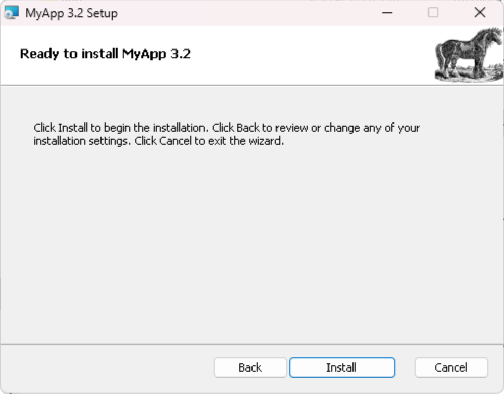
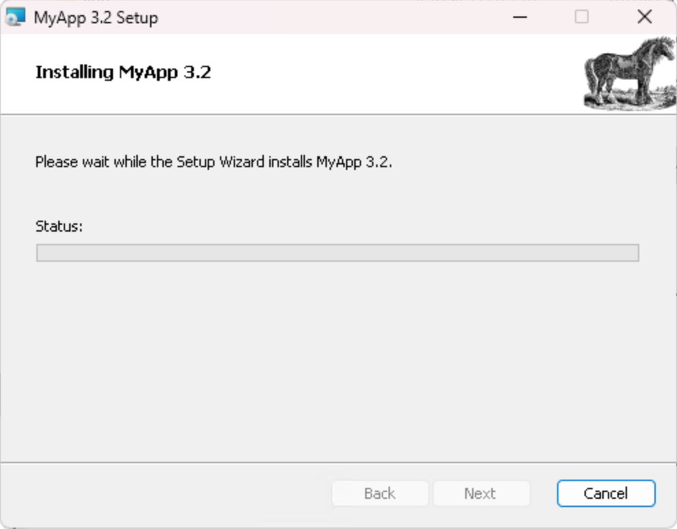
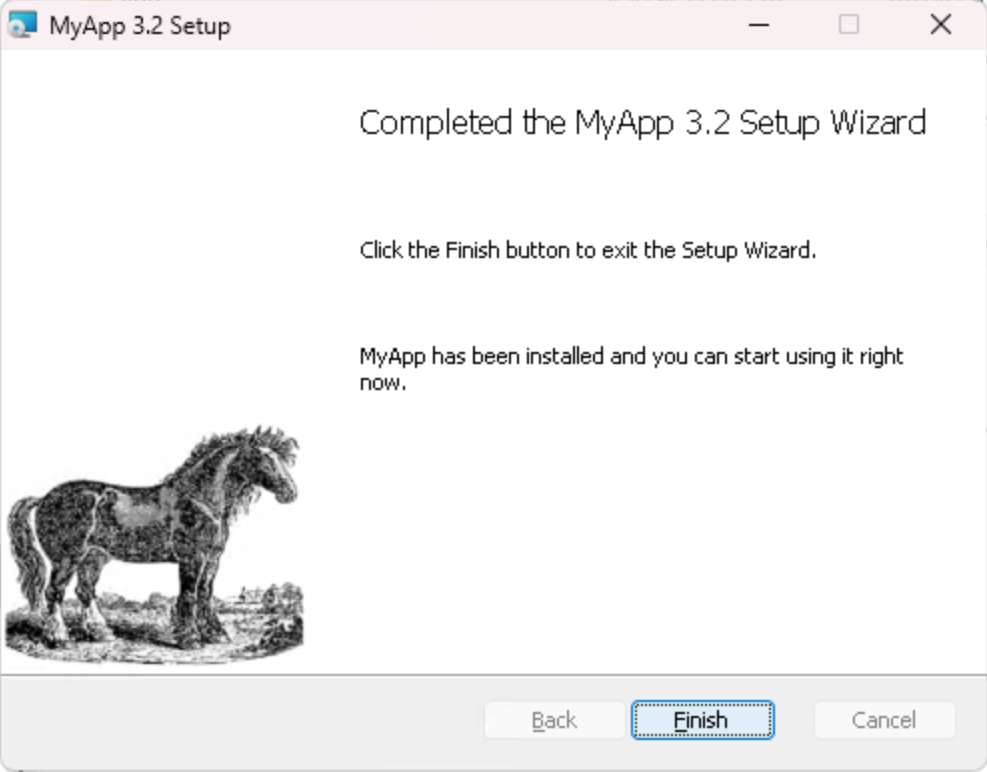

# OCaml Universal Installer

OCaml Universal Installer or oui, is a tool that produces standalone installers
for your OCaml applications, be it for Linux, Windows or macOS.


## Installation layout

oui aims at producing the most consistent installs across platforms but each
as its own specifities.

The following sections describes how an application is installed on the three
main platform it supports.

### Linux

Executing a `.run` produced by oui will install the application in
`/opt/<appname>`:

```
/opt/<appname>/
├── bin
│   ├── <binary1>
│   └── <binary2>
└── uninstall.sh
```

the `bin/` subfolder will contain all executables for the application.
A symlink to those will also be written to `/usr/local/bin/`.

An `uninstall.sh` script is also installed alongside the application
that can be run to cleanly remove it from the system.


### Windows / WiX

A WiX-generated MSI installer can be installed either per-user, or per-machine,
which requires admin rights. This will install the application in different locations.

For a per-user installation:

- application in `C:\Users\<username>\AppData\Local\Programs\<appname>`
- shortcuts in `C:\Users\<username>\AppData\Roaming\Microsoft\Windows\Start Menu\Programs\<appname>`
- registry entries in `HKEY_CURENT_USER\SOFTWARE\<appname>`

For a per-machine installation:

- application in `C:\Program Files\<appname>`
- shortcuts in `C:\ProgramData\Microsoft\Windows\Start Menu\Programs\<appname>`
- registry entries in `HKEY_LOCAL_MACHINE\SOFTWARE\<appname>`

The exact location and name of the application folder may actually be
customized by the user through the installer UI.

Note: it is not clear whether all three folders should be named `<appname>`.
Typically the shortcut folder has a more descriptive / longer name.

##### Package metadata

In order to create an MSI installer, a few metadata must be provided, some required, some optional.

###### Required metadata

- Package unique ID (eg: 'OCamlPro.Oui'), necessary for upgrades to work properly
- Package name (eg: 'Oui 1.4'), shown in installer UI and Windows Application manager
- Package manufacturer (eg: 'OCamlPro'), only shown in MSI properties
- Package version (eg: '1.4.2.0'), note the last number is usually not significant and ignored during upgrades

###### Optional metadata

- Package description/comment, shown in MSI properties
- Package keywords, shown in MSI properties
- Package icon (in ICO format), shown in Windows Application manager
- License text (in RTF format) ; we may provide a few standard licenses ; this is displayed by the installer (skipped if no license)
- Banner and background images (BMP/PNG format), displayed on each windows of the installer ; we may provide overridable defaults

##### Shortcut specification

A shortcut requires the following information:

- Name
- Target (relative to the application folder)
- Description (only shown in the shortcut properties/tooltip, might not be useful)

##### Internet shortcut specification

An internet shortcut requires the following information:

- Name
- Target (URL)

##### Environment variable specification

An environment variable requires the following information:

- Name
- Part: all, prepend, append (those two use the ';' separator, useful for PATHS)
- Value

##### Registry entry specification (not sure if useful to expose)

A registry entry requires the following information:

- Name (relative to registry key)
- Type: string, int, ...
- Value


#### Typical install UI










### macOS / Application Bundle

To be written.


